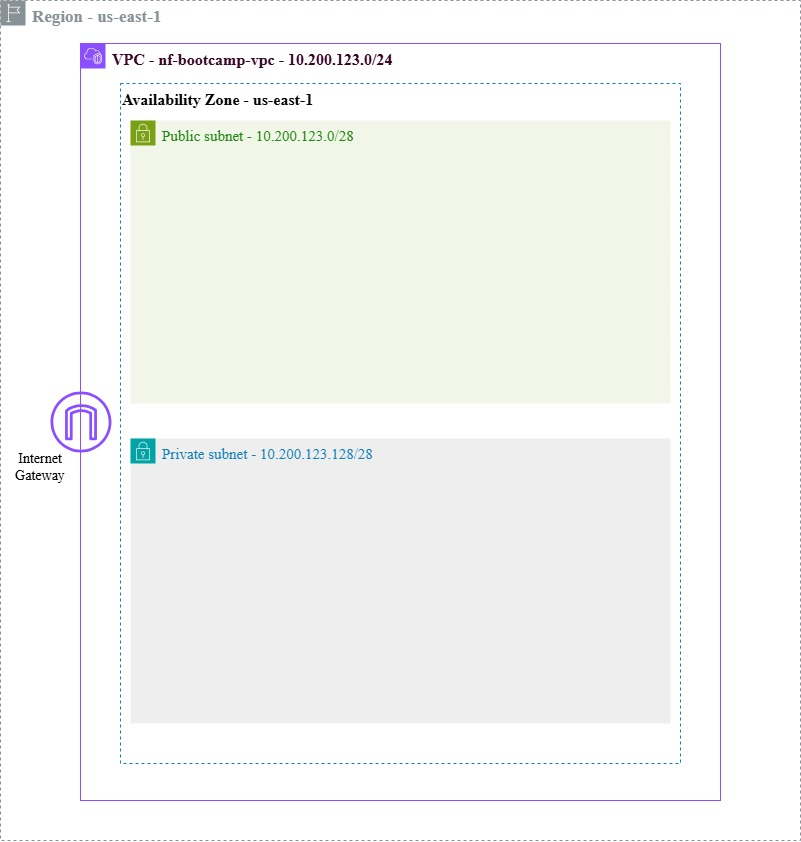
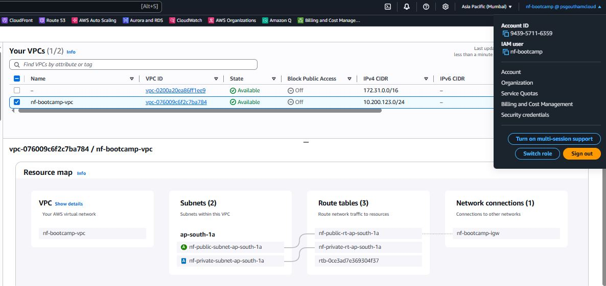
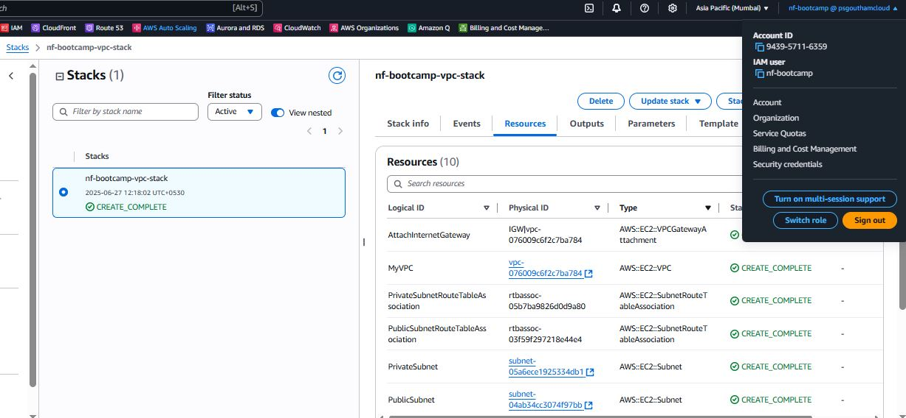

## Journaling

- [Setting up the Cloud environment]()
### VPC Settings

These are the VPC settings thought out for our AWS cloud environment:

VPC IPv4 CIDR Block: 10.200.123.0/24
IPv6 CIDR Block: No
Number of AZs: 1
Number of Public Subnets: 1
Number of Private Subnets: 1
NAT Gateways: None
Public Subnet IPv4 CIDR Block: 10.200.123.0/28
Private Subnet IPv4 CIDR Block: 10.200.123.128/28
VPC Endpoints: None
DNS Options: Enable DNS Hostnames
DNS Options: Enable DNS Resolution

### Generated and reviewed cloud formation template

Based on the instructor videos, noted the VPC settings and provided this to LLM to produce a CFN template to automate the provisioning of the VPC.

I had to use an LLM to refactor the yaml to add parameters so that I dont have to hardcode values for VPC CIDR, etc, and hence the template is reusable.

### Generated deployment script

Using ChatGPT, generated a `bin/deploy` bash script. Changed the shebang to work for all OS platforms.

### Visualisation of the VPC using draw.io

Below is the architecture diagram for the VPC, done through draw.io (diagrams.net)

### Installing AWS CLI

In order to run the deployment script, we need to have the AWS CLI installed. We will follow the instructions from the link [AWS CLI Installation](https://docs.aws.amazon.com/cli/latest/userguide/getting-started-install.html)

### Deployed VPC to AWS

This is the VPC that is deployed in the ap-south-1a region through the CFN template.

