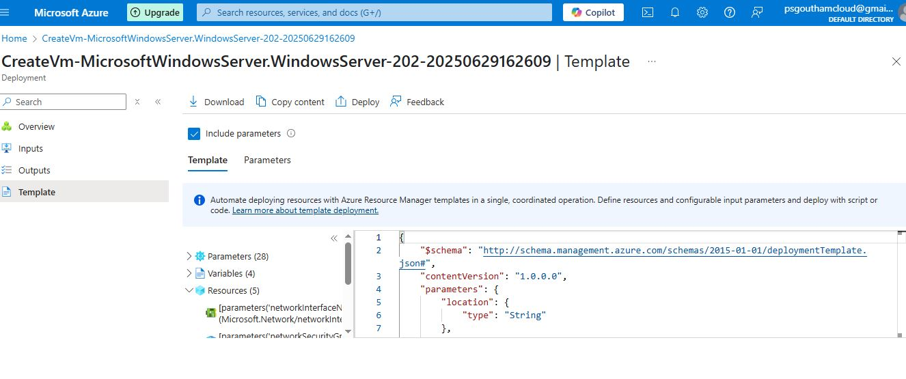

## Downloaded Azure Resource template

After deploying a Microsoft Windows Data Center Server 2022 to Azure, I donwloaded the resource templates (.json files), to be able to deploy easily again.




### Converting template json to Azure Bicep

I launched the Data Center version of Windows Server 2022, which didn't come with a GUI to work with. 
I want to reuse the template json files, to launch an instance of Windows Server, but they are cumbersome to work with. So I'm going to convert the json template into Azure Bicep script, in order to automate the deployment.

Install and Login to Azure CLI
I need to install the Azure CLI in order to work with this.

Downloaded the CLI for windows using the link [https://aka.ms/installazurecliwindows](https://aka.ms/installazurecliwindows)

Then verified the installation in the console with the command ```az --version```.

Login to Azure CLI using the command ```az login --use-device-code```


Convert to azure bicep
```
cd ip-address-management/template/vm
az bicep  decompile --file template.json
```

If successful, it will generate a template.bicep file, in the same location.
