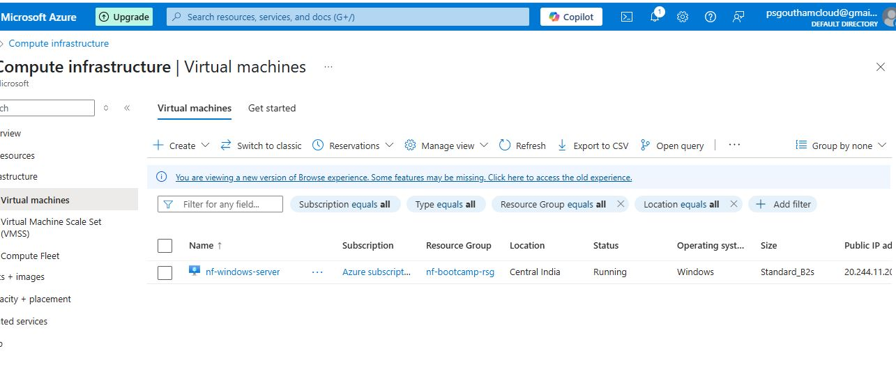

## Deploy Windows Server

I have decided to deploy a Windows 11 Enterprise N, version 22H2 – x64 Gen2 image on the Central India region.

```
cd ip-address-management/template.vm
az deployment group create \
  --resource-group nf-bootcamp-rsg \
  --template-file template.bicep \
  --parameters @parameters.json
```

